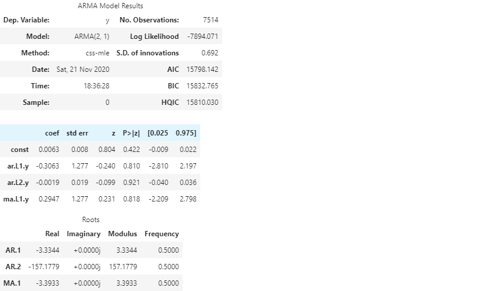
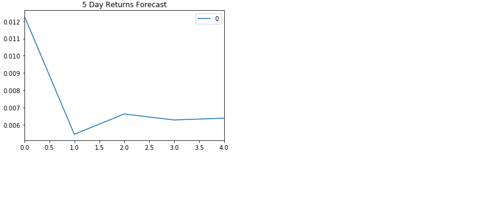
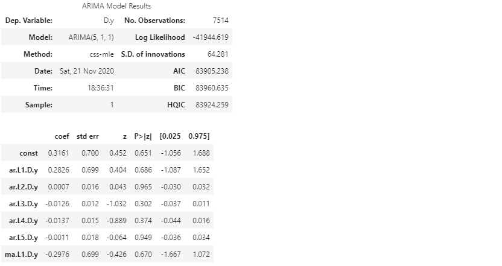
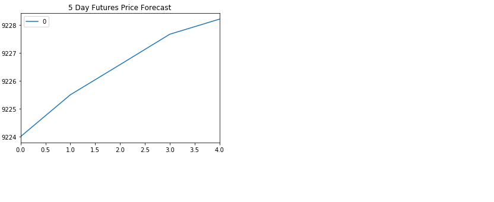
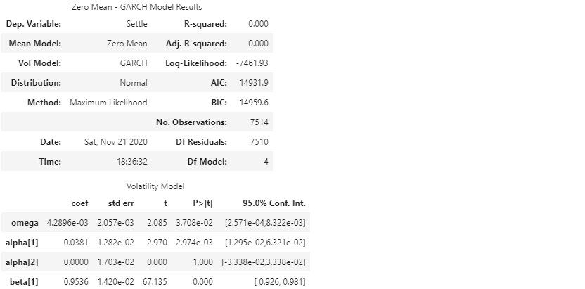
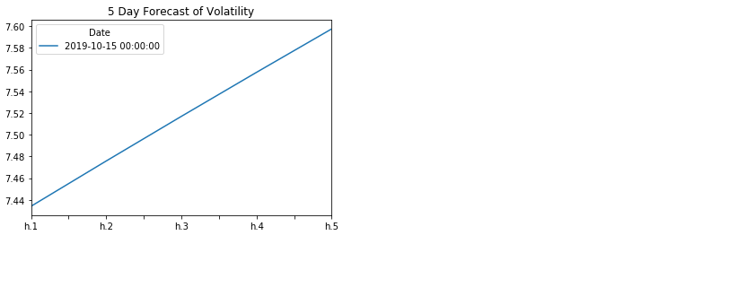

# timeseries_hw10
Homework 10 Time Series

# Time-Series Forecasting

This notebook demonstrates the forecasting of yen prices using the time series forecasting models

The following steps were executed as part of this activity

1. Decomposition using a Hodrick-Prescott Filter (Decompose the Settle price into trend and noise).
2. Forecasting Returns using an ARMA Model.
3. Forecasting the Settle Price using an ARIMA Model.
4. Forecasting Volatility with GARCH.

## Results 

### The ARMA model has a p value > 0.05 and might not be a good fit model.

### The ARIMA model has a p value > 0.05 and might not be a good fit model.

### The GARCH model has a p value < 0.05 and seems to be a good fit model.

## Conclusion

The GARCH model predicts an increase in volatility for the 5 day forecast. Hence I would not buy the yen now since it would be highly volatile and can go either way. The risk of the yen is expected to increase.
I feel confident the GARCH model can be used for trading as it highlights the volatility/risk for the future.

# Linear Regression Forecasting

The following steps were executed as part of this activity:

1. Data Preparation (Creating Returns and Lagged Returns and splitting the data into training and testing data)
2. Fitting a Linear Regression Model.
3. Making predictions using the testing data.
4. Out-of-sample performance.
5. In-sample performance.

## Results

Out-of-Sample Root Mean Squared Error (RMSE): 0.4154832784856737

In-sample Root Mean Squared Error (RMSE): 0.5963660785073426

## Conclusion

The out-of-sample RMSE is lower than the in-sample RMSE. RMSE is typically lower for training data, but is higher in this case. This model performs better on out-of-sample data compared to in-sample data.